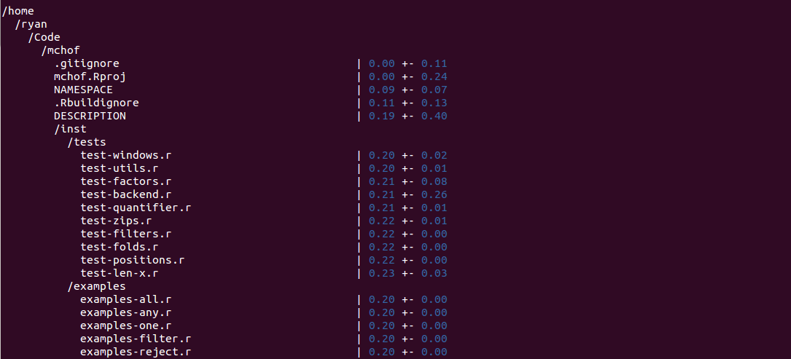

Fresh
======================

Fresh is a command-line tool for gathering statistics on
the age of a git code-base.

 </img>

Code-age is a useful metric for determining what code has been
overlooked and needs maintainance or what code is fresh and needs testing. Maintaining
large code-bases is difficult, so fresh is another tool to determine what needs work.

It can also indicate if a project is stagnant or rapidly evolving.

Fresh is VERY slow for large repositories, as git must fetch modification dates
for each line in every file in a project.

### Usage

```bash
fresh git::rgrannell1/fresh
```

### Requirements

#### General:

* R
* Git
* A UNIX operating system (tested on Ubuntu 14.04.1)

#### Packages:

* Docopt
* Methods
* Git2R
* Kiwi v0.37.0

### Installation

```R
if (!require(devtools)) {
    install.packages("devtools"); library(devtools)
}

devtools :: install_github("rgrannell1/kiwi", ref = 'v0.37.0')
devtools :: install_github("ropensci/git2r")
devtools :: install_github("edwindj/docopt.R")

```

### License

Fresh is released under the MIT licence.

The MIT License (MIT)

Copyright (c) 2014 Ryan Grannell

Permission is hereby granted, free of charge, to any person obtaining a copy of this software and associated documentation files (the "Software"), to deal in the Software without restriction, including without limitation the rights to use, copy, modify, merge, publish, distribute, sublicense, and/or sell copies of the Software, and to permit persons to whom the Software is furnished to do so, subject to the following conditions:

The above copyright notice and this permission notice shall be included in all copies or substantial portions of the Software.

THE SOFTWARE IS PROVIDED "AS IS", WITHOUT WARRANTY OF ANY KIND, EXPRESS OR IMPLIED, INCLUDING BUT NOT LIMITED TO THE WARRANTIES OF MERCHANTABILITY, FITNESS FOR A PARTICULAR PURPOSE AND NONINFRINGEMENT. IN NO EVENT SHALL THE AUTHORS OR COPYRIGHT HOLDERS BE LIABLE FOR ANY CLAIM, DAMAGES OR OTHER LIABILITY, WHETHER IN AN ACTION OF CONTRACT, TORT OR OTHERWISE, ARISING FROM, OUT OF OR IN CONNECTION WITH THE SOFTWARE OR THE USE OR OTHER DEALINGS IN THE SOFTWARE.
